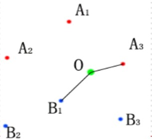
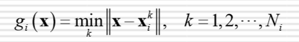
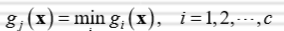

#### KNN（k-NearestNeighbor）算法，即k-近邻算法

近邻法是一种根据样本提供的信息，绕开概率的估计而直接决策的技术，所以它属于非参数判别方法的一种。

#### KNN的算法思想：

KNN原理上属于模板匹配。将待测样本放入已知样本当中，以最相似的K个已知样本的类标，取数量最多的类标作为此待测样本的类标。

以最近邻法距离：

对于一个C类别的问题，假设每类有Ni个样本，i = 1, 2,  ..., C，则第i类wi的判别函数为：

 其中xik表示是wi类的第k个样本。

决策规则为： 如果

，则决策X∈wj

 (在以上公式中，使用||·||表示距离，这只是一个象征性的表示，其实可以采用任何一种相似性的度量，一般采用欧氏距离的相似性的度量比较多。而实际上因为特征向量的各分量之间对应的物理意义很可能不一致，所以使用哪个度量应看问题而定)

#### KNN的优缺点：

优点：

*   算法思想简单，实现方法简单
*   在模板数量很大时，其错误率指标还是相当不错的

缺点：

*   计算量大（每一个样本进行KNN时，都需要与所有已知样本进行计算）
*   存储量大（需要存储大量已知样本作为模板）

  

* * *

明确目标：

1.  编写KNN算法，当K = 1时， 即为最近邻算法。  
    
2.  封装为类（直接给KNN传入样本集，测试集和K，输出结果为测试集预测出的对应类标）

##### 1\. 计算欧氏距离

根据式子，每一个待测样本需要与训练集中的样本求欧氏距离，于是定义函数：

1.  `def eucldist_vectorized(self, coords1, coords2):`
2.   `""" Calculates the euclidean distance between 2 lists of coordinates. """`
3.   `return np.sqrt(np.sum((coords1 - coords2)  **  2))`

##### 2\. 记录下K个最小距离的类标

1.  `tmp =  []`
2.  `for i in range(sample.__len__()):`
3.   `for x in sample[i]:`
4.   `euc_distance = np.linalg.norm(np.array(t)  - np.array(x))`
5.   `# o_distance = self.eucldist_vectorized(t, s)`
6.   `if len(tmp)  <= k:`
7.   `tmp.append([i, euc_distance])  # format [cls, euc_distance]`
8.   `else:`
9.   `tmp.sort(key=itemgetter(1), reverse=True)`
10.   `# print tmp`
11.   `if euc_distance < tmp[0][1]:`
12.   `tmp[0]  =  [i, euc_distance]`

在这里，tmp列表用于记录K个最近邻的样本。其每个元素的记录格式为\[类标，这个样本与待测样本的距离\]

当tmp列表的长度小于K时，直接记录这一样本的信息

若tmp列表的长度等于K时，先对tmp列表按euc_distance有大到小排序，然后直接与列表第一项比较，若其距离小于第一项的距离，则更新这第一项

##### 3\. 处理tmp列表

因为得到最相似的K个样本后，其对应的欧氏距离将没有意义，所以从tmp列表中去掉euc_distance的记录

1.  `tmp = np.array(tmp)[:,  0].tolist()`

##### 4\. 确定此待测样本类标

1.  `def set_class(self, tmp):`
2.   `dir =  Counter(tmp)`
3.   `c = dir.most_common()[0][0]`
4.   `# print c`
5.   `return c`

通过Counter函数统计tmp列表中的值，Counter会自动把出现次数最多的类标放置于首位，于是取出首项类标，即为我们所需。

* * *

以上代码封装好后，就可以根据我们实际数据进行操作了。最后统计出结果。

在实际使用过程中，我们会发现，样本数量多，计算时间过长，效果虽好，代价太大。所以我们可以采用一些优化算法，以提取出训练集的特征，减少样本数量。

以下列出三种优化算法（先不细说，有空再说~）：

*   快速近邻算法
*   剪辑最近邻算法
*   压缩近邻法

* * *

  

最后，因为本人初出茅庐，涉世不深，如本文有何纰漏，敬请指出   
另外，若你知道代码有何更好更简洁的编写方法  
请您告诉我~谢谢~感激不尽  
