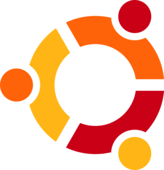
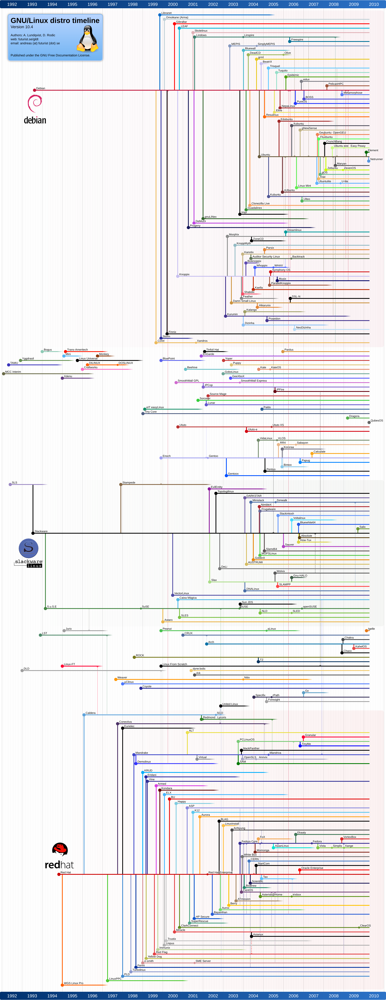
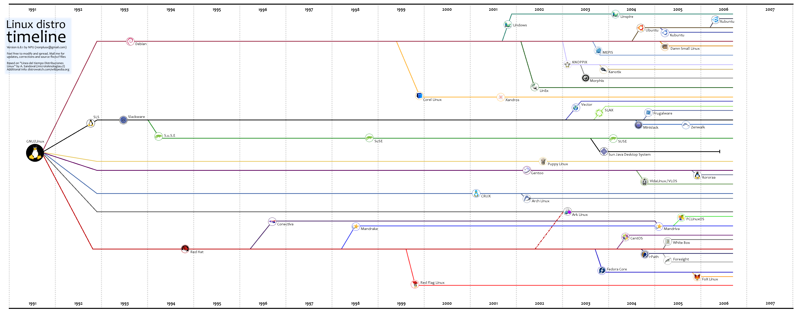

My Linux,Linux (1)
------------------

### Linux是什么

Linux是一套免费使用和自由传播的类Unix操作系统，是一个基于POSIX（可移植操作系统接口）和UNIX的多用户、多任务、支持多线程和多CPU的操作系统。  
Linux可以运行在多种硬件平台上，此外Linux还是一种嵌入式操作系统，可以运行在掌上电脑、机顶盒或游戏机上。同时Linux也支持多处理器技术。多个处理器同时工作，使系统性能大大提高。  
然后我们再给出更直观的认识，mac就是基于Unix的操作系统，还有我们手机里的Android系统也是基于Linux为内核。  
所以我们可以得到一个基本认识，Linux是跟Windows一样，是一个操作系统，而且因为其开源性，以及支持多种硬件平台，所以基本在我们日常生活中，很多地方都运行着Linux系统。

* * *

### Linux的发行版

Linux有很多发行版，这些发行版由个人，松散组织的团队，以及商业机构和志愿者组织编写。它们通常包括了其他的系统软件和应用软件，以及一个用来简化系统初始安装的安装工具，和让软件安装升级的集成管理器。  
Linux通常是我们对这些发行版的总称，而我们通常使用的Linux系统则是使用的这些发行版。在这里，关于Linux发行版的细节不作过多介绍，有兴趣可以先看看Linux版本分支图，进行了解。以下我们粗略介绍三款Linux发行版。

1.  Ubuntu（乌班图）  
    我们最为常用的Linux发行版。Ubuntu是一个以桌面应用为主的Linux操作系统。其属于debian系，软件管理使用deb，apt-get，更新频繁，软件多，有自带商店，可以从商店里直接下载，界面友好，适合新手入门。另外，还有好多开源项目都是基于ubuntu的，例如机器人操作系统ros。  

    
2.  CentOS  
    CentOS追求稳定，有些软件并不是最新的，而是最稳定的，更新升级慢（如果有严重bug也会快速升级）所以服务器常用这个发行版。软件管理用yum机制。
    
3.  Deepin  
    国产操作系统，可替代Windows，颜值高，堪比MAC。更好的是，深度科技与多个国内厂商合作，推出了网易云、QQ、输入法等适合中国国情的软件。另外，该系统还可以直接运行安卓程序，系统生态圈大大加强！最后，由于该系统也是基于Debian的，所以也存在大量的库！所以简单的开发也是可以的。总而言之，如果你已经彻底厌烦了windows，又苦于Ubuntu没有中国人常用的软件，Deepin是你的最好选择！  

    

#### 总结

linux虽然版本繁多，分支复杂，但是linux发行版的大多数指令都是通用的。我们在选择linux版本的时候建议：侧重于linux下开发的用Ubuntu，侧重于服务器方向的用Centos，侧重于替代Windows的，可选用Deepin。但是对于某些大型项目只在特定发行版兼容的，我们就没得选了，例如上面提到的如果你想学习Ros操作系统，那就只能选择Ubuntu了。

* * *

### Linux能干什么，与windows的区别

现在，Linux主要有两方面的应用：  
1.在企业环境与学术环境中：  
\- 服务器  
因为通常服务器资源有限，而且每次服务器崩溃的时候，都有着相当大的损失，所以对系统的稳定性就有很高的要求。而且因为追求稳定性，默认是没有图形化界面的（因为图形化界面会占用相当的计算资源） \- 关键任务的应用（金融资料库，大型企业网管环境）  
\- 学术机构的高效能运算任务 2.个人使用上  
\- PC个人电脑  
\- 手持系统（手机，笔记本电脑等）  
\- 嵌入式开发系统  
首先，我们先了解嵌入式是什么。 _一个嵌入式系统装置一般都由嵌入式计算机系统和执行装置组成，嵌入式计算机系统是整个嵌入式系统的核心，由硬件层、中间层、系统软件层和应用软件层组成。执行装置也称为被控对象，它可以接受嵌入式计算机系统发出的控制命令，执行所规定的操作或任务。执行装置可以很简单，如手机上的一个微小型的电机，当手机处于震动接收状态时打开；也可以很复杂，如SONY 智能机器狗，上面集成了多个微小型控制电机和多种传感器，从而可以执行各种复杂的动作和感受各种状态信息。_ 以上摘自百度。 所以简单解释，嵌入式就是用于控制、监视或者辅助操作机器和设备的装置，将程序直接运行在机器内部。  
而Linux用作嵌入式开发，有着很好的优势。因为嵌入式通常要求低功耗，所以多使用Arm的处理器，于是支持Arm的Linux就有了天生的优势。我们就可以在Linux下编写代码，直接连接硬件运行程序。 Linux和windows的区别：  
它们两个系统区别有很多很多，这里就不细说了，这里给出两段话，供大家体会一下：

*   Linux: 免费给你一堆车的零件，你自己拼辆车。  
    Windows: 直接卖给你一辆性能相当靠谱的车，而且满大街都是这样的车，维护起来成本相对更低，而且车的相关设备很完备。
    
*   二者最重要的区别乃是它们对自己的用户所做的假设。  
    对于 Linux，这个假设是：  
    用户知道自己想要什么，也明白自己在做什么，并且会为自己的行为负责。  
    而 Windows 则恰好相反：  
    用户不知道自己想要什么，也不明白自己在做什么，更不打算为自己的行为负责。
    

* * *

### 怎么学习Linux

首先声明，Linux是用来开发工作使用的，不是用来娱乐玩游戏的（假如你认为工作是种乐趣那就另当别论啦~） 在Linux下的操作是自由的，你甚至可以删除系统的整个盘（有兴趣可以看看这个案例http://www.zdkit.com/?p=230） 学习Linux，在我个人学习中，我认为多去使用Linux是关键。在本系列教程中，我们将会使用Ubuntu进行讲解，从最初的安装Linux到后续的基础指令等等。 如果想学习服务器方面的知识，推介看看VBird鸟哥的教程（http://linux.vbird.org/linux_basic_train/unit01.php#）  
另外贴出关于Linux的学习资源（参见网站： https://zhuanlan.zhihu.com/p/21723250?refer=passer）  
网络上学习资料千千万，究竟你能学进去多少，就看个人本事了。 最后，再打一发关于Linux的广告，如上提到的ROS系统就是在Linux下运行的，ROS是一个机器人平台，想要制作机器人的就千万不要错过了。另外现在最热的深度学习，也是主要在Linux进行开发的。所以，走出Windows设下的温室，在Linux下大展身手ba~~  
  
  

### 附件列表

