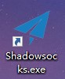
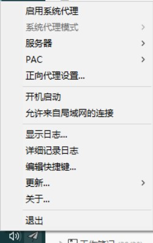

双击打开Shadowsocks.

任务栏会出现这个图标。

对图标进行右键，可看到如下菜单。

先点服务器，先对服务器配置进行修改。然后将你的服务器地址密码等信息填入以后，正常就能使用了。

点击启用系统代理，则挂上VPN。在浏览外网的时候，可以看到这个图标的指示

表明VPN正常使用。

然后点击系统代理模式。分别有PAC模式以及全局模式。通常浏览外网使用PAC模式就足够了。若使用全局模式，有可能使一些电脑软件不能上网。（如开启全局模式以后，网易云音乐无法播放音乐）

最后是，当有时候发现关闭了SS，但是又不能上网时，有可能因为SS启动了系统代理，修改了某个配置，而你又没有关闭SS里的系统代理导致的。