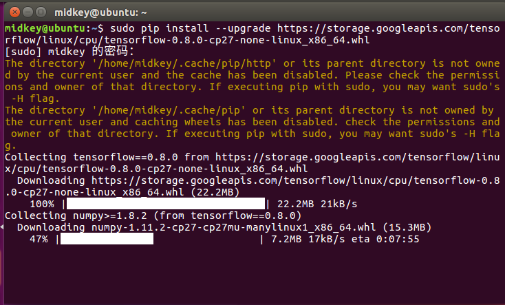
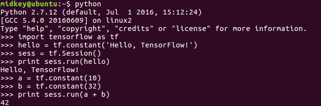

1\.安装python pip 和 python-dev
```
sudo apt-get install python-pip python-dev
```
2\. 安装TensonFlow
```
sudo pip install --upgrade [https://storage.googleapis.com/tensorflow/linux/cpu/tensorflow-0.8.0-cp27-none-linux\_x86\_64.whl](https://storage.googleapis.com/tensorflow/linux/cpu/tensorflow-0.8.0-cp27-none-linux_x86_64.whl)
```


如遇错误 多试几次 再不行 VPN翻墙

3\. 测试TensonFlow

终端输入 python

然后import tensonflow as tf

