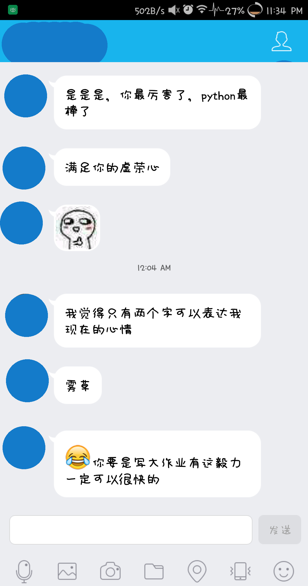

事情的起因是这样的：


于是呼，写下了下面的代码输入不同的time，可以得到不同的结果  
```
#!/usr/bin/python
# -*- coding: UTF-8 -*-
time = 5
guess = ['你猜我']
for x in range(time):
    guess.append('猜你')
str = ''
for x in guess:
    str += x
last = '猜不猜'
str += last
print str[0:]
```

运用到的知识：  
*   字符串的拼接  
*   列表的扩展
*   字符串的输出，不能直接这样输出
*   输出的时候用\[0:\]可以去掉引号  
    
```
print guess

['\xe4\xbd\xa0\xe7\x8c\x9c\xe6\x88\x91', '\xe7\x8c\x9c\xe4\xbd\xa0', '\xe7\x8c\x9c\xe4\xbd\xa0', '\xe7\x8c\x9c\xe4\xbd\xa0', '\xe7\x8c\x9c\xe4\xbd\xa0', '\xe7\x8c\x9c\xe4\xbd\xa0']
```
  
她这样回复的： 

 

她敢嘲笑我大Python不行，说Python麻烦，于是吸取她的代码经验，不需要存储直接print就好(我经常犯这种错误，经常存储起来然后使用！！！)
```
print  "%s%s%s"  %  ('你猜我',  5*'猜你',  '猜不猜')
```
这个地方也可以这样写：
```
print  "{}{}{}".format('你猜我',  5*'猜你',  '猜不猜')
```
这个地方不能这样写，是因为：
```
print '你猜我',
for x in range(5):
    print '猜你',
print '猜不猜'
```

因为Python中默认print是换行输出的，所以这里要加逗号，但是这样的话会有空格 结果如下：
```
你猜我  猜你  猜你  猜你  猜你  猜你  猜不猜
```
就着这个时候，他说不行，逻辑是错的，应该是你猜与我猜交叉： 于是经过近乎斗气般的努力： 敲出了如下语句：
```
print  "".join([('猜你'  if x %  2  ==  0  else  '猜我')for x in range(1,  11)])
```
首先我们是这样添加头的：
```
print  "hello".join([('猜你'  if x %  2  ==  0  else  '猜我')for x in range(1,  11)])
```
然而出现了下面情况：
```
猜我hello猜你hello猜我hello猜你hello猜我hello猜你hello猜我hello猜你hello猜我hello猜你
```
查原因请看附录中join的用法 然后改成这样添加头与尾：
```
`print  "{}{}{}".format('你猜我',  ''.join([('猜你'  if x %  2  ==  1  else  '猜我')for x in range(1,  11)]),  '猜不猜')`
```
效果：
```
你猜我猜你猜我猜你猜我猜你猜我猜你猜我猜你猜我猜不猜
```
  
最终当然是我伟大的Python赢了，于是乎结果：



  
附录：

Python的join用法：

函数：string.join()

Python中有join()和os.path.join()两个函数，具体作用如下：
    join()：    连接字符串数组。将字符串、元组、列表中的元素以指定的字符(分隔符)连接生成一个新的字符串
    os.path.join()：  将多个路径组合后返回

一、函数说明
1、join()函数

语法：  'sep'.join(seq)

参数说明
sep：分隔符。可以为空
seq：要连接的元素序列、字符串、元组、字典
上面的语法即：以sep作为分隔符，将seq所有的元素合并成一个新的字符串

返回值：返回一个以分隔符sep连接各个元素后生成的字符串

2、os.path.join()函数

语法：  os.path.join(path1[,path2[,......]])

返回值：将多个路径组合后返回

注：第一个绝对路径之前的参数将被忽略

二、实例

#对序列进行操作（分别使用' '与':'作为分隔符）
```
>>> seq1 = ['hello','good','boy','doiido']

>>> print ' '.join(seq1)

hello good boy doiido

>>> print ':'.join(seq1)

hello:good:boy:doiido
```
 

 #对字符串进行操作
```
>>> seq2 = "hello good boy doiido"

>>> print ':'.join(seq2)

h:e:l:l:o: :g:o:o:d: :b:o:y: :d:o:i:i:d:o
```
 

 #对元组进行操作
```
 >>> seq3 = ('hello','good','boy','doiido')

>>> print ':'.join(seq3)

hello:good:boy:doiido
```

 #对字典进行操作 
```
>>> seq4 = {'hello':1,'good':2,'boy':3,'doiido':4}

>>> print ':'.join(seq4)

boy:good:doiido:hello
```
 

 #合并目录
```
>>> import os

>>> os.path.join('/hello/','good/boy/','doiido')

'/hello/good/boy/doiido'
```

* * *

Python一行打印心形：
```
`print'\n'.join([''.join([('PYTHON!'[(x-y)%7]if((x*0.05)**2+(y*0.1)**2-1)**3-(x*0.05)**2*(y*0.1)**3<=0  else' ')for x in range(-30,30)])for y in range(15,-15,-1)])`
```