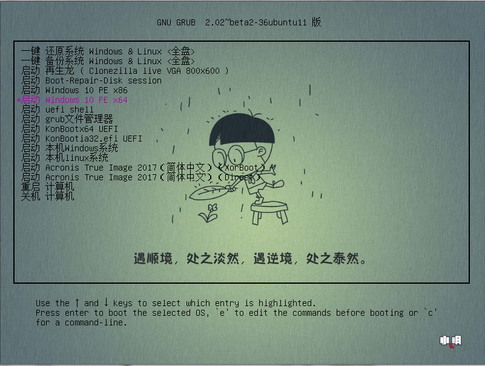
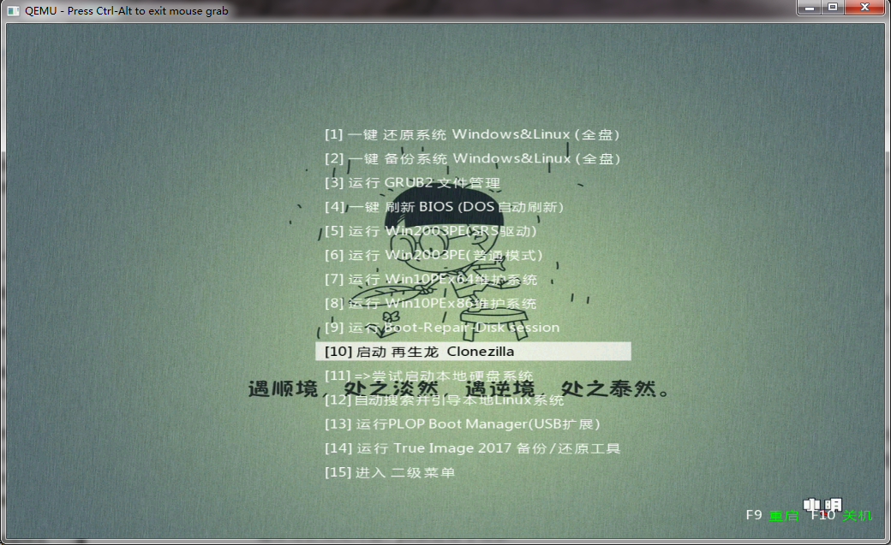
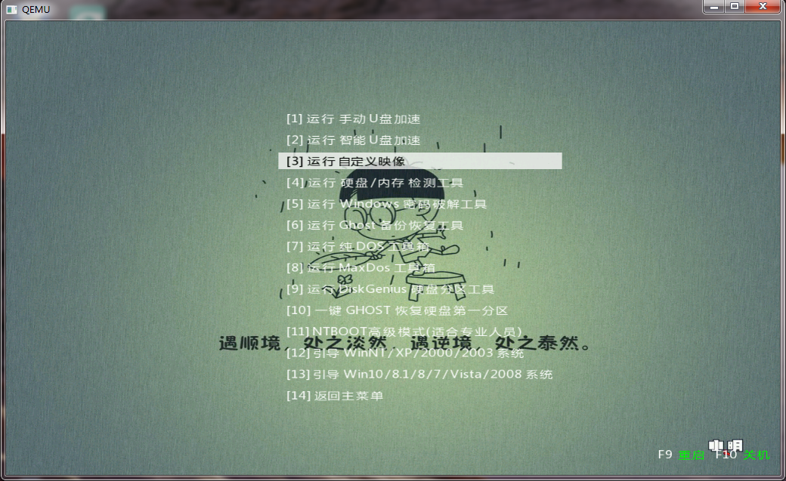

这次PE是我在无忧论坛上多个大神的作品拼接而成，大神们的作品都很好（若大神不高兴，我将撤回此贴，毕竟不是自己创作的，我只是搬运工而已）。由于我的专业相关，需要经常使用Linux系统，所以肯定需要维护Linux系统，要不然一言不合就重装。。。 该PE无任何捆绑，更不会篡改主页，请各位放心使用！！！ 什么？？度盘链接。。。额，还没有开始上传，小水管表示，啥时候上传完了就分享出来。 上传完了，，度盘链接，，[提取码：QSZD](https://pan.baidu.com/s/1eR86S0M) 感觉1400700226在网页上引用的这两句话不错，在此也引用一下。。。

> 用欢喜心去付出，以平常心来受苦      ——66369

> 既然免费，岂能不纯净？！          ——微PE工具箱

该Pe由以下几个部分组成，因为本人的能力有限，所以在wuhenxpe发布的[诺达佳U盘维护系统 v5.51](http://bbs.wuyou.net/forum.php?mod=viewthread&tid=388040)基础上来进行修改，修改的时候主要参考的PECMD脚本来自由chxm1023猫大的[优元素PE](http://bbs.wuyou.net/forum.php?mod=viewthread&tid=361122)，PE的启动背景来源于小明PE，部分组件来源于小小日天发布的[一个不知道叫什么名字的PE](https://359303267.github.io/)。特此表示感谢：

1.  由1400700226修改的我心如水典藏版[Windows 03PE](http://bbs.wuyou.net/forum.php?mod=viewthread&tid=366263)，水老的03PE有软件兼容性强、简单易懂的特点，支持网络。
2.  由ljycslg发布的[Win10 RS3 16299 PE x86+x64](http://bbs.wuyou.net/forum.php?mod=viewthread&tid=378234)，支持网络特别好，兼容性强。
3.  可以备份Linux系统的台湾发布的再生龙。
4.  专门用于Linux维护的boot repair disk，主要用来修复Ubuntu引导，可用于调整Linux分区。
5.  由wintoflash大师发布的 [grub2文件管理器](http://bbs.wuyou.net/forum.php?mod=viewthread&tid=384999)，可以在不烧录Ubuntu镜像的情况下安装Linux系统。
6.  ATI备份软件2017
7.  更改了由chxm1023猫大的[优元素PE](http://bbs.wuyou.net/forum.php?mod=viewthread&tid=361122)中的PE工具箱，添加了部分软件，软件来源于各大神的PE，在此一一表示感谢。

已知bug：

1.  windows 03PE概率性出现无法加载外置工具，出现这种情况的时候请重新插拔U盘，不然PE无法挂载U盘到我的电脑，原因未知，已经按照2010LeMing大神发布的帖子 [使PE可以挂载U盘第二分区内的外置工具……](http://bbs.wuyou.net/forum.php?mod=viewthread&tid=196085) 更改了内核，还是概率性的出现，原因未知。大神知道的请告知。在此表示感谢
2.  部分外置工具，例如Potplayer在windows 03PE下无法使用，在win10PE下可以。
3.  部分外置工具在win10PE下由于缺少MSVBVM60.DLL，无法使用，这个bug日后1.1版修复。至于1.1啥时候更新，看心情吧！

部分说明：

1.  支持由独剑老师等研究出来的三分区格式，windows03PE放在udm分区低端隐藏，windows10pe以及，再生龙，boot repair disk，外置工具放在高端隐藏区。
2.  采用boot repair disk而不是ubuntu live以及口袋Linux porteus的原因是因为我经常碰见ubuntu 引导崩溃的情况，使用前者可以修复引导，虽然ubuntu live也可以修复引导，但是体积太大，ubuntu 12.04虽然体积小，但是想必对新的电脑兼容性不强。所以便采用了boot repaire disk。
3.  本pe体积比较大，总共占用U盘 2G 的空间，我也在体积大小方便纠结了好久，不过后来想想，自己每次U盘好像没有被塞满过，而且这PE可以同时维护Linux和windows，不管是windows 03PE还是，windows10 x86 x64 pe，还是boot repair disk均可上网。也就值了吧。
4.  本程序制作采用的是由kva大神开发的[优启通](http://bbs.wuyou.net/forum.php?mod=viewthread&tid=364890)。其中，U盘模式肯定是可以用的，其余的功能待测试。
5.  由于时间紧迫，因为我要学习啊（嘻嘻，不要打我），所以仓促中完成了本PE的整合，请各位看官帮忙一起找找bug，一起解决解决。

什么？？又有啥问题？无图无真相啊！好好好，容我去截个图，我去去就来。。 。。。。。。 10分钟过去了，我想说，为啥几年前我还会使用VM虚拟机，怎么现在不会了。。在折腾折腾，各位看客散去吧。 回来喽，，昨晚又发现了一些新问题，不过问题不大，现在放图：

*   uefi启动画面：

*   bios启动画面：

*   bios启动二级菜单

