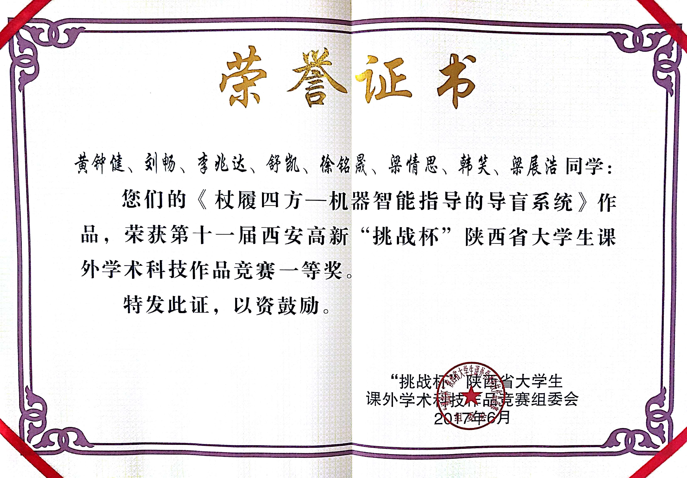
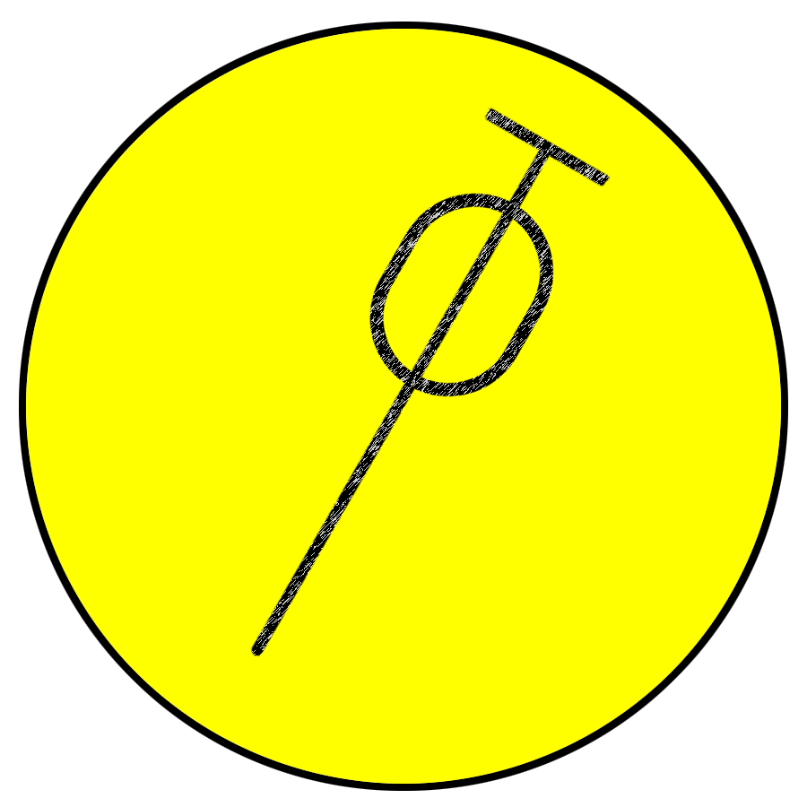

大三下学期马上就要过去了，怎么说呢，这学期感觉过得简直了。  

首先，学习上吧，因为挑战杯的原因翘课都已经翘上瘾了。机器学习连续翘课4次，就再也不知道老师说的啥了。这学期的老师感觉也有点不太重视上课，无论是公茂果，还是缑水平，上课吹牛逼已经成为了一种习惯。 而且，就算是正常上的课，也不会认真听讲的。可能因为听说大三的课比较水，也许是因为自己已经太懒了，也许是自己渐渐地发现突击两天的成绩也不错吧。做项目做的多的时候，渐渐的发现基础理论对自己有多么重要，也渐渐的发现了数学才是我们的硬道理。无论是看别人写的代码，还是看论文的时候，发现自己碰到许多公式的时候，就会看不下去了。一来是自己的基础理论过于薄弱，二来是自己做项目做的心里已经十分浮躁了，不能静下来心了。不知道为什么，自从高一的那场病之后，再也不能静下心来学习了。那次病之后，开始包容自己。容许自己放松。

其次，在挑战杯上，已经做了这么久。一开始不属于这个团队，后来因为参与了一部分，成为了一员。熬过无数个日日夜夜，放弃了很多东西，放弃了很多大作业，也放弃了很多课。记得当初朱伟在群里说过：“大家要分清什么是重要的事情，什么是最紧急的事情。”于是，在写说明书的那一段时间，我连着翘了很多节课，每天熬夜到3点多，甚至通宵。曾经无数次的告诉自己，再熬过这段时间就好了，过了这几天，我就解放了。只是，欺骗过自己很多次之后，再也不相信自己所说的话了，什么再过段时间就解放了之类，一切都是浮云，根本就没有所谓的解放，永远都有事情要做。挑战杯初期，我参加了两个队，那个时候感觉没有什么事情，后来越来越感觉到不太对劲，因为自己在两个队，当两个队都缺人的时候，自己比较纠结。直到后来，和某人发生了争执之后，就感觉这样不行的，一个人不可以同时参与两个队，否则会忙到要吐血，而且吃力不讨好。而且，因为参加了车的队，导致自己错失了一波跟着黄钟健学东西的大好时机，自己在天天跑demo中，也算是一大遗憾。幸亏黄钟健是一个特别好的人，特别懂得体谅队员，这样的领导很得人心，让大家都感觉想跟着他干。在这里我就不吐槽某人，现在想起来某人还是很生气，从来没见过这么厚颜无耻之人，一点没有领导能力，只能让人感受到社会公司的气息。毕竟社会上的人都会耍流氓么。自己说过的话前后不一致，自己打自己的脸，眼里只有利益的人不配跟我交朋友，竟然还骂我女朋友，真TMD智障。不过，他也是刷新我三观，告诉我在这个世界上，不是看你的努力程度，而是看你的结果，看结果好不好，你过程很努力，但是没有结果，好，那就感谢你一路的付出。所以说，能力对于一个人来说，特别特别的重要，我一直相信，绝对的实力压倒一切。所有的一切对你不好的事情就是因为你的实力不够强，在这个世界上，弱，本身就是一种错。能力，并不仅仅包括敲代码，写论文，设计算法的能力，还包括自己以前不太重视的能力，比如说，ppt、ps、ae、word等文档与展示的能力。我发现向别人展示自己的能力也是一件特别重要，也是一件特别难的事情，但是我的性格、我的信仰告诉我，只要做好自己的事情就好了，低调的做事。最喜欢的明星是许嵩，为人有实力但是很低调。现阶段的任务还是加强自己的实力吧，与人交流方面可以适当的加强，不忘初心就好，不要知道一点东西就傲的不能行就好。另外，挑战杯是一个重视宣传与创新的比赛，作品可以没有做出来，但是作品一定要有创新性、宣传性、可以代表这个时代的最新发展，具有一定的前瞻性。挑战杯获得了省一的好成绩，虽然进不去国赛了，因为本身我们也认识到了这个作品的限制性。不知在西电这个环境中，能不能进省赛、国赛跟指导老师是不是有关系，不过，这已经不重要了。

所谓有得必有失，虽然进不去国赛，但是我通过这个比赛，一、学到了很多东西，比如怎么使用深度学习的一些demo实现自己的想法；二、通过自己在挑战杯的经历，顺利从张向荣跳到了杨淑媛的手下，而且还得到了杨淑媛的认可。三、也是最重要的一点，我找到了一个可爱、漂亮、坚强、乐观的女朋友。从此人生的旅途不再是自己一个人，情思，我一定会一直爱她，给她稳稳地幸福。自己的肩膀上也多了责任，我要好好学习，买房子娶情思。因为，我爱她，我要跟她一直在一起，在人生的旅途中，一起欣赏风景，一起一起。。。

最后，谈一下对考研的想法，因为我不一定能保研。所以，做好考研的心里准备也是极好的。首先，考研最直接的帮助是让我打下坚实的数学基础，数学很重要。同时，又能进一步提高自己的英语能力，阅读、听力、写作能力，这些都是及其重要的。信号的知识，对于研究生的研究也是很有重要的。政治的一些东西，可以让我真正的了解马克思主义到底是什么。我感觉通过一年的学习，让我打下坚实的基础，这并不是浪费我的时间，这是很值得的。其次，通过考研，我可以让自己飘了几年的心静一静了，自从高中的那场病之后，我就再也没有很静心的学习过了。然后，考研的时光也许可以轻松一点，闲暇时间，阅读一些自己喜欢的书籍，思考一下人生，也是挺好的。最后，我考研有我的情思陪着，我怕什么，而且还可以给她铺铺路。这也是极好的。  

有得必有失，一切都看透就好。  

